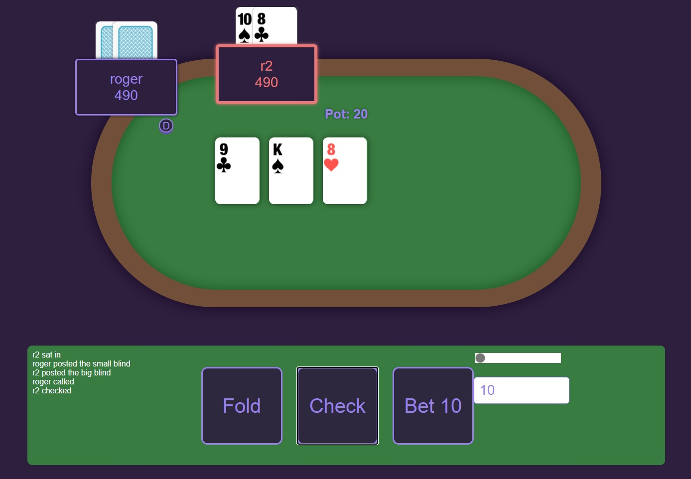

Poker
=====

A poker application running on node.js with socket.io, using angularJS on the front-end for data binding.
Simple layout, easy to host and play.

For deployment on Azure, please see [here](https://azure.microsoft.com/en-us/develop/nodejs/) for more information.